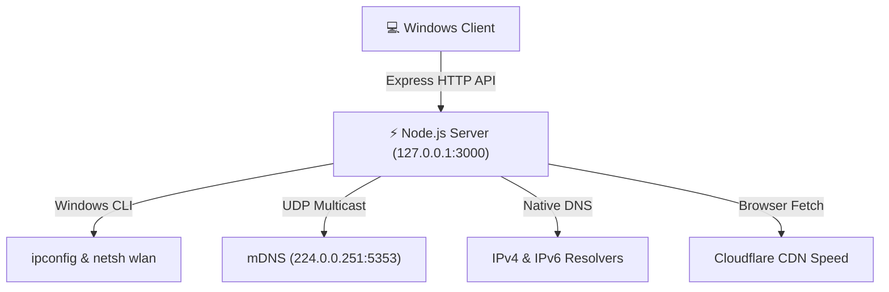

<p align="center">
  
</p>

# ⚡ HyperSpeed Local Network Performance Auditor


A modern, high-performance web dashboard and diagnostic utility designed to audit local network hardware, internet throughput, DNS resolution latency, smart home mesh devices, and bufferbloat.

Built with **Node.js, Express, Chart.js, Lucide Icons, and Vanilla CSS Glassmorphism**.

---

## 🌐 Universal Compatibility

While optimized for high-speed Fiber connections and Wi-Fi 6E mesh routers, **HyperSpeed Auditor** is 100% universal. It automatically auto-detects and audits:
- **Any ISP**: Frontier, Verizon Fios, Comcast Xfinity, Spectrum, AT&T, Cox, etc.
- **Any Router or Mesh System**: Nest Wifi, Netgear Nighthawk, Asus ROG, UniFi, Eero, TP-Link, etc.
- **Any Interface**: Ethernet Gigabit/2.5GbE, Wi-Fi 4/5/6/6E on Windows 10/11.

---

## 🌟 Key Features

- **📊 Dual-Stack IPv4 & IPv6 DNS Shootout**: Simultaneously benchmarks 22+ primary and secondary public resolvers (Cloudflare, Quad9, Google, OpenDNS, AdGuard) against local router DNS endpoints to identify the fastest DNS provider for your location.
- **⚡ Bufferbloat & Latency Under Load Audit**: Evaluates idle ping vs. loaded ping during active download/upload streaming and assigns Bufferbloat grades (`A+` to `F`).
- **🏠 Smart Home & Thread Mesh mDNS Scanner**: Discovers active Thread Border Routers (Nest Wifi Pro), Matter endpoints, Apple HomeKit accessories, and Google Cast devices on your local subnet using native UDP multicast (`224.0.0.251:5353`).
- **🛡️ Egress DNS Leak Test**: Inspects outgoing DNS traffic to verify queries are fulfilled by encrypted/anycast public resolvers without leaking to ISP defaults.
- **📥 AI-Ready JSON Exporter**: Compiles system state, adapter configurations, speed results, and DNS benchmarks into a 100% complete JSON report for processing in AI models (Gemini, ChatGPT, Claude).
- **📈 Speed History & Trend Logging**: Automatically records test runs into a local `history.json` store and renders interactive throughput trend graphs over time.
- **💻 Hardware & Interface Inspector**: Parses native Windows `ipconfig /all` and `netsh wlan show interfaces` outputs to display Wi-Fi 6E (6GHz) channels, PHY rates, and Ethernet link statistics.

---

## 🛠️ Technology Stack & Architecture



- **Backend**: Node.js, Express, `dgram` (UDP multicast), `child_process` (`ipconfig`, `netsh`, `ping`, `tracert`), Native Promises DNS Resolver
- **Frontend**: HTML5, Vanilla CSS3 (Glassmorphism & Neon Cyberpunk theme), Vanilla JavaScript (ES6+), Chart.js, Lucide Icons
- **Security**: Bound strictly to `127.0.0.1` loopback with strict regex input sanitization.

---

## 🚀 Quick Start

### Prerequisites
- [Node.js](https://nodejs.org/) (v16 or higher)
- Windows OS (for native `ipconfig` & `netsh` hardware parsing)

### Installation

1. **Clone the repository**:
   ```bash
   git clone https://github.com/DigitalDistraction/local-network-performance.git
   cd local-network-performance
   ```

2. **Install dependencies**:
   ```bash
   npm install
   ```

3. **Start the server**:
   ```bash
   npm start
   ```

4. **Open in your browser**:
   Navigate to [http://localhost:3000](http://localhost:3000) (or `http://127.0.0.1:3000`).

---

## 🔌 API Endpoint Reference

| Endpoint | Method | Description |
| :--- | :--- | :--- |
| `/api/diagnostics` | `GET` | Parses local network adapters, Wi-Fi 6E radio details, and ISP WAN info. |
| `/api/ping-test` | `GET` | Runs ICMP ping iterations to calculate RTT latency, jitter, and packet loss. |
| `/api/dns-benchmark` | `POST` | Executes DNS resolution shootout across 22+ IPv4/IPv6 resolvers. |
| `/api/dns-leak` | `GET` | Inspects egress DNS resolver IP to audit ISP DNS leaks. |
| `/api/iot-scan` | `GET` | Transmits mDNS query packets to discover Thread, Matter, and Cast nodes. |
| `/api/traceroute` | `GET` | Streams real-time path hops using Server-Sent Events (SSE). |
| `/api/history` | `GET / POST / DELETE` | Manages speed test history logs stored in `history.json`. |

---

## 🤝 Contributing

Contributions, issues, and feature requests are welcome! Feel free to check the [issues page](https://github.com/DigitalDistraction/local-network-performance/issues) or submit a Pull Request.

---

## 📄 License

This project is licensed under the [MIT License](LICENSE).
